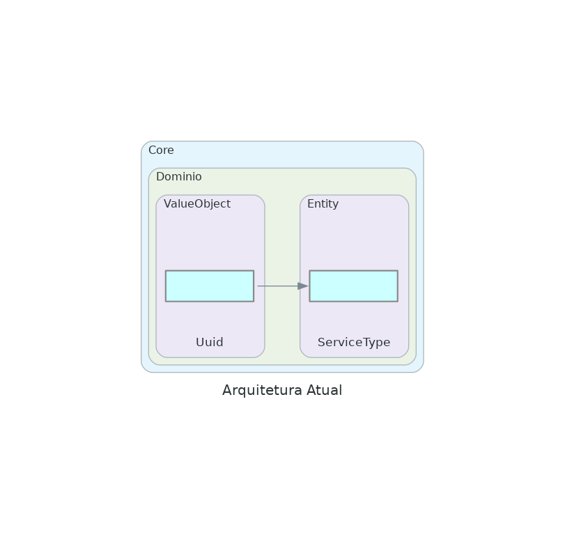

# orcamentos.otao.dev.br

## Sistema para orçamentos da OtaoDev Tecnologia
O sistema será desenvolvido seguindo DDD (DOmain Driven Design) juntamente com a Clean Architecture

[Documento de Casos de Uso](docs/casos.md)

